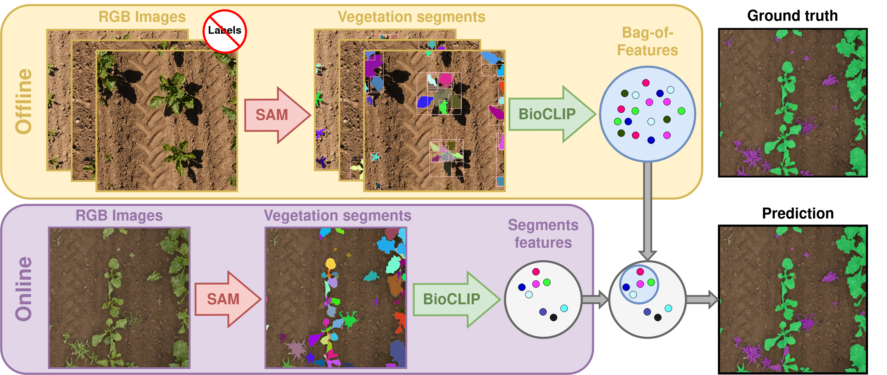

# Weeds are Weird (WaW)

Paper (under review): Zero-Shot Semantic Segmentation for Robots in Agriculture



Our approach can segment crop plants and weeds without labels. 
We leverage foundation models [SAM](https://github.com/facebookresearch/segment-anything) and the [ViT from BioCLIP](https://imageomics.github.io/bioclip/) to build a bag of features representing crop plants. 
During inference, we extract plant features and compare them with the bag of features.
Plant features with low similarity with the bag of features are inferred as weeds.


Qualitative results on different datasets. The top row shows input image, the second row shows ground truth, and the third row
shows our performance.


## Installation
```bash
pip install -r requirements.txt
cd src/ipb-loaders; pip install -U -e . 
wget -P scripts/sam/ https://dl.fbaipublicfiles.com/segment_anything/sam_vit_l_0b3195.pth
```

## Usage
### 0. Prepare data sets
The data set should follow the following directory structure:  
```
${PARENT_DIR}  
├── train  
│   └── images  
├── val  
│   ├── images  
│   └── semantics  
└── test  
    ├── images  
    └── semantics
```
For further details, see the data set directory structure of [PhenoBench](https://www.phenobench.org/).

### 1. Curating the Bag of Features of Crop Plants

1. Obtain vegetation segments for train split images with SAM
```bash
python3 scripts/get_bb_clips.py \
  --input_dir <path to dataset> \
  --output_dir <path of output dir> \
  --split train \
  --vis_dir <optional, path of output dir of visualisations> \
  --vm_dir <optional, path of output dir with vegetation masks> \
  --aug_cfg <optional, path to augmentation configuration file. defaults to ./cfgs/augs_clip.cfg> \
  --points_per_side <optional, number of point prompts for SAM>
```
This will give the patches saved as .png files. 
Additionally, if specified, the point prompts used to prompt SAM in vis_dir 
and the resultant vegetation masks of the input images in vm_dir.

2. Separate out the popular features using BioCLIP's ViT   
First, you need to create a .yaml file; see ./cfgs/vote_phenobench.yaml for an example.

```bash
python scripts/bioclip_popularity.py --yaml_cfg ./cfgs/vote_phenobench.yaml --output_dir <output dir for patches of crop plants>
```

### 2. Inference 

```bash
python scripts/get_predictions_bioclip.py --yaml_cfg ./cfgs/vote_phenobench.yaml --crop_feats_dir <output dir for patches of crop plants> --vis_dir <output dir path>
```


### 3. Evaluation
```bash
python evaluate.py \
  --parent_gen_dir ${INF_DIR} \
  --gt_dir <ground truth labels> \
  --img_size 1024 \
  --center_crop;

```


